# 🔍 Domain Finder

[](LICENSE)
[](https://python.org)
[](-)


LLM-агент для поиска свободных доменных имён. Генерирует креативные названия на основе описания проекта и проверяет их доступность через WHOIS.

> ✨ **Обновление 2.0**: Теперь с полноценным веб-интерфейсом! 🌐

---

## 📑 Оглавление

- [Возможности](#-возможности)
- [Быстрый старт](#-быстрый-старт)
- [Структура проекта](#-структура-проекта-полная-с-комментариями)
- [Конфигурация](#️-конфигурация)
- [Как это работает](#-как-это-работает)
- [Разработка](#️-разработка)
- [Статус задач](#-статус-задач)
- [Ограничения](#️-ограничения)
- [Лицензия](#-лицензия)

---

## ✨ Возможности

### 🔹 CLI-режим (консоль)

- 🤖 Генерация доменов через LLM (OpenRouter API или локальный Ollama)
- 🔌 Архитектура с поддержкой нескольких провайдеров
- 🔍 Проверка доступности через WHOIS (параллельно, до 10 потоков)
- 💾 In-memory кэширование результатов WHOIS
- 🪵 Логирование в файл + эмодзи в консоли
- 📄 Экспорт результатов в JSON

### 🔹 Web-интерфейс (Flask) — 🆕

- Тёмный UI с градиентами, анимациями и эффектом матового стекла (Glassmorphism)
- 🧩 Компоненты: чипсы для выбора зон, stepper (+/−) для количества, карточки результатов
- ⚡ Мгновенная проверка подключения: индикатор `⏳` → `✓` (зелёный) / `✗` (красный)
- 📋 Динамический список моделей: подгружается после выбора провайдера
- 📊 Статистика в бейджах: «✅ 5 свободных / ❌ 3 занятых / ❓ 2 неизвестно»
- 💾 Экспорт результатов в JSON: кнопка «💾», читаемая кириллица, `prompt` в файле
- ♿ Доступность: семантический HTML, `aria-*` атрибуты, `for` у лейблов
- 📱 Адаптивность: медиа-запросы, перестроение сетки на мобильных
- 🧼 Архитектура: модульный JS (IIFE), CSS-переменные (OKLCH), разделение `ui.css` / `app.css`

---

## 🚀 Быстрый старт

### 1. Клонирование и окружение

```powershell
python -m venv .venv
.\.venv\Scripts\Activate
pip install -e .
```

### 2. Настройка (`.env`)

```bash
# OpenRouter
OPENROUTER_API_KEY=sk-or-v1-xxxxxxxxxxxxxxxx
OPENROUTER_URL=https://openrouter.ai/api/v1/chat/completions

# Ollama (опционально)
OLLAMA_BASE_URL=http://localhost:11434

# Логирование и кэш
LOG_LEVEL=INFO
TTL=3600
```

### 3. Запуск

#### 🔹 Консоль

```powershell
python src/domain_finder/main.py
# или
domain-finder
```

#### 🔹 Веб

```powershell
python src/domain_finder/web/app.py
# Открыть: http://127.0.0.1:5000
```

> 💡 Для авто-обновления при разработке:  
> `pip install flask-livereload` + `LiveReload(app)` в `app.py`

### 4. Использование (Web)

1. Введите описание проекта
2. Выберите провайдера → дождитесь индикатора `✓` (подключено) или `✗` (ошибка)
3. Выберите модель из динамического списка
4. Отметьте доменные зоны чипсами (`.com`, `.ru`, `.io`...)
5. Укажите количество (stepper `−` / `+`)
6. Нажмите **«Найти домены»**
7. Результаты отобразятся с анимацией:

   ```bash
   📊 Результаты:
   ┌─────────────────────────────────┐
   │ example-app.com  [СВОБОДЕН] ✓   │
   │ bestservice.ru   [ЗАНЯТ]    ✗   │
   │ myproject.io     [НЕИЗВЕСТНО] ? │
   └─────────────────────────────────┘
   ✅ 5 свободных  ❌ 3 занятых  ❓ 2 неизвестно
   ```

8. Нажмите **«💾 Экспорт в JSON»** для скачивания отчёта

---

## 📁 Структура проекта (полная, с комментариями)

```bash
domain_finder/
│
├── .env                          # Переменные окружения: ключи API, URL, настройки логирования
├── pyproject.toml                # Зависимости, метаданные проекта, entry points для pip install -e .
├── README.md                     # Этот файл: документация, быстрый старт, структура
├── LICENSE                       # Лицензия MIT
├── .gitignore                    # Исключаемые файлы (venv, .env, logs)
├── docs/                         # Скриншоты и дополнительная документация
│   └── screenshot.png            # Скриншот веб-интерфейса (добавить вручную)
├── logs/                         # Автоматически создаваемая папка для логов
│   └── domain_finder.log         # Полный лог приложения (DEBUG+), ротация не настроена
│
└── src/domain_finder/
    │
    ├── __init__.py               # Маркер пакета Python, пустой файл
    │
    ├── config.py                 # Централизованные настройки: ключи, списки моделей, TTL, LOG_LEVEL
    │                             # Импорт из .env через python-dotenv, валидация форматов
    │
    ├── main.py                   # Точка входа для CLI-режима: интерактивный ввод, оркестрация потока
    │                             # Логирование с префиксами [CLI:*], экспорт в JSON по запросу
    │
    ├── logger.py                 # Инициализация логгера: EmojiFormatter, разделение хэндлеров
    │                             # Консоль: WARNING+ с эмодзи; Файл: DEBUG+ с полным контекстом
    │
    ├── cache.py                  # Потокобезопасный in-memory кэш с TTL (SimpleCache класс)
    │                             # Глобальный экземпляр whois_cache для WHOIS-ответов (TTL=3600s)
    │                             # Логирование операций кэша: [CACHE:HIT/MISS/SET]
    │
    ├── llm/                      # Модуль работы с LLM-провайдерами
    │   │
    │   ├── __init__.py           # Экспорт провайдеров для удобного импорта извне
    │   │
    │   ├── provider_base.py      # Абстрактный базовый класс LLMProvider: интерфейс методов
    │   │                         # load_config(), validate_connection(), check_model(), generate()
    │   │
    │   └── providers/            # Реализации конкретных провайдеров
    │       │
    │       ├── __init__.py       # Пустой файл, маркер пакета
    │       │
    │       ├── openrouter_provider.py  # Провайдер для OpenRouter.ai (облачный)
    │       │                         # Валидация ключа (sk-or-*), проверка соединения, генерация
    │       │                         # Логирование: [openrouter:CONFIG/CONNECT/MODEL/GENERATE:*]
    │       │
    │       └── ollama_provider.py      # Провайдер для локального Ollama (self-hosted)
    │                                 # Проверка наличия моделей через /api/tags, генерация через /api/chat
    │                                 # Подсказки при ошибках: "ollama pull <model>", логирование аналогично
    │
    ├── checker/                  # Модуль проверки доступности доменов
    │   │
    │   ├── __init__.py           # Пустой файл, маркер пакета
    │   │
    │   └── whois.py              # Параллельная WHOIS-проверка с кэшированием
    │                             # Функции: check_domain_availability(), check_domains_parallel()
    │                             # Консервативная эвристика: таймауты = unknown, а не taken
    │                             # Подавление "грязного" вывода библиотеки python-whois
    │                             # Логирование: [WHOIS:CACHE/RESULT/BATCH:*]
    │
    └── web/                      # Flask веб-интерфейс
        │
        ├── app.py                # Flask-приложение: маршруты API, кэш провайдеров, экспорт JSON
        │                         # Эндпоинты: /, /api/generate, /api/check-provider, /api/get-models,
        │                         #            /api/check-model, /api/json_export
        │                         # Кэш экземпляров провайдеров: _provider_cache (конфиг грузится 1 раз)
        │
        ├── templates/            # Jinja2-шаблоны
        │   │
        │   └── index.html        # Единственная страница приложения: форма, результаты, экспорт
        │                         # Семантический HTML, ARIA-атрибуты, подключение static-файлов
        │
        └── static/               # Статические файлы (CSS, JS, шрифты)
            │
            ├── css/
            │   │
            │   ├── styles.css    # Точка входа: импортирует ui.css + app.css (для порядка загрузки)
            │   │
            │   ├── ui.css        # Дизайн-система: сброс стилей, CSS-переменные (OKLCH), шрифты (Fira Code),
            │   │                 # цветовая схема (светлая/тёмная), утилитарные классы
            │   │
            │   └── app.css       # Компоненты UI: форма, чипсы, stepper, карточки результатов, анимации,
            │                     # кнопка экспорта, медиа-запросы для адаптивности
            │
            ├── js/
            │   │
            │   └── app.js        # Клиентская логика: модуль IIFE, обработка формы, fetch-запросы,
            │                     # рендер результатов, экспорт JSON, XSS-защита (escapeHtml),
            │                     # таймауты для запросов, управление состоянием UI
            │
            └── assets/           # Ресурсы (шрифты, иконки)
                │
                └── fonts/
                    └── FiraCode/ # Моноширинный шрифт для кода/доменов
                        └── woff2/
                            └── FiraCode-VF.woff2  # Variable font, оптимизированный вес
```

> 💡 **Нейминг (стандарты проекта):**
>
> - **Python**: `snake_case` для файлов/функций, `PascalCase` для классов, импорты по полным путям
> - **CSS**: BEM-like (`.component`, `.component__element`, `.component--modifier`), переменные через `--`
> - **JS**: IIFE-модуль, `const`/`let`, `camelCase` для функций, строгий режим `"use strict"`

---

## ⚙️ Конфигурация

### `config.py` — централизованные настройки

| Переменная           | Описание                    | Пример                             |
| -------------------- | --------------------------- | ---------------------------------- |
| `OPENROUTER_API_KEY` | Ключ для OpenRouter         | `sk-or-v1-...`                     |
| `OPENROUTER_URL`     | Endpoint API                | `https://openrouter.ai/api/v1/...` |
| `OPENROUTER_MODELS`  | Список моделей для перебора | `["qwen/...", "arcee-ai/..."]`     |
| `OLLAMA_BASE_URL`    | Адрес локального Ollama     | `http://localhost:11434`           |
| `OLLAMA_MODELS`      | Локальные модели            | `["llama3.2", "qwen2.5"]`          |
| `TTL`                | Время жизни кэша (сек)      | `3600`                             |
| `LOG_LEVEL`          | Уровень логов для консоли   | `logging.INFO`                     |

### 🎨 Дизайн-система (CSS-переменные)

```css
:root {
  /* Цвета (OKLCH + HEX fallback) */
  --color-primary: oklch(69% 0.18 45);
  --color-success: oklch(70% 0.18 145);
  --color-error: oklch(68% 0.22 25);

  /* Типографика (адаптивная) */
  --font-size-md: clamp(0.875em, 0.78em + 0.48vw, 1em);

  /* Отступы (4px-сетка) */
  --spacing-4: 1rem;

  /* Анимации */
  --transition-normal: 0.2s ease-in-out;
}

[data-theme="dark"] {
  --color-bg: oklch(0.2972 0 0);
  --color-text: oklch(0.9067 0 0);
}
```

---

## 🧠 Как это работает

### Консольный режим

```bash
1. Выбор провайдера → 2. load_config() → 3. validate_connection()
→ 4. Перебор моделей → 5. generate() → 6. WHOIS (параллельно)
→ 7. Вывод + экспорт в JSON (по запросу)
```

### Веб-режим (Flask + JS)

```mermaid

flowchart LR
    A[🌐 Браузер] -->|POST /api/generate| B[⚙️ Flask]
    B --> C{✅ Валидация}
    C -->|❌| D[400 Bad Request]
    C -->|✅| E[🤖 LLM + 🔍 WHOIS]
    E --> F[📦 JSON-ответ]
    F --> G[🎨 JS: рендер карточек с анимацией]

    H[🔄 /api/check-provider] --> I[⚡ Индикатор: ⏳ → ✓/✗]
    J[🔄 /api/get-models] --> K[📋 Динамический <select>]
    L[🔄 POST /api/json_export] --> M[💾 Скачивание файла]

    classDef api fill:#3b82f6,color:white;
    class B,E,H,J,L api;
```



---

## 🛠️ Разработка

### 🔹 Добавить провайдера (общий шаг)

1. Файл: `src/domain_finder/llm/providers/new_provider.py`
2. Класс: `class NewProvider(LLMProvider)` с методами `load_config()`, `validate_connection()`, `check_model()`, `generate()`
3. Экспорт в `llm/__init__.py`
4. Добавить выбор в `main.py` (CLI) и `<select>` в `index.html` (Web)

### 🔹 Веб: новый компонент

**Правила:**

- ✅ Использовать переменные из `ui.css` (`var(--color-primary)`)
- ✅ Добавлять `aria-*` для доступности
- ✅ Обрабатывать состояния: `loading`/`success`/`error`/`disabled`
- ✅ Экранировать ввод в JS (`escapeHtml()`)

**Пример (CSS):**

```css
/* app.css */
.my-component {
  background: var(--color-bg);
  border: 1px solid var(--color-border);
  color: var(--color-text);
  transition: var(--transition-normal);
}
.my-component:hover {
  border-color: var(--color-primary);
}
```

**Пример (JS внутри IIFE):**

```javascript
function initMyComponent() {
  const el = document.getElementById("my-component");
  el?.addEventListener("click", () => {
    // Логика
  });
}
document.addEventListener("DOMContentLoaded", initMyComponent);
```

---

## 📋 Статус задач

### ✅ Завершено (CLI)

| Задача                         | Статус |
| ------------------------------ | ------ |
| 🔁 Дедупликация результатов    | ✅     |
| 💾 In-memory кэш WHOIS с TTL   | ✅     |
| 📄 Экспорт в JSON (консоль)    | ✅     |
| 🪵 Логирование в файл + эмодзи | ✅     |
| 🦙 Поддержка Ollama            | ✅     |
| 🗂️ Рефакторинг по PEP 8        | ✅     |

### ✅ Завершено (Web UI)

| Задача                   | Фактическая реализация                                 |
| ------------------------ | ------------------------------------------------------ |
| 🌐 Flask-сервер + Jinja2 | ✅ `app.py`, `index.html`                              |
| 🎨 Дизайн-система        | ✅ `ui.css`: OKLCH, Fira Code, dark mode               |
| 🧩 Компоненты формы      | ✅ Чипсы, stepper, select-wrapper                      |
| ⚡ Индикатор подключения | ✅ Текст: `⏳` → `✓` (зелёный) / `✗` (красный)         |
| 📋 Динамические модели   | ✅ `/api/get-models` + авто-заполнение `<select>`      |
| 📊 Карточки результатов  | ✅ Анимация `slideIn`, border-left, бейджи с иконками  |
| ♿ Доступность           | ✅ `aria-labelledby`, `role="group"`, `for` у лейблов  |
| 📱 Адаптивность          | ✅ `@media (max-width: 600px)`, grid → column          |
| 💾 Экспорт в JSON (Web)  | ✅ Кнопка «💾», `ensure_ascii=False`, `prompt` в файле |

### ✅ Завершено (Оптимизация)

| Задача                                | Фактическая реализация                                             |
| ------------------------------------- | ------------------------------------------------------------------ |
| 🔄 Кэш экземпляров провайдеров        | ✅ `_provider_cache` в `app.py`: конфиг грузится 1 раз за сессию   |
| 🪵 Единый стандарт логирования        | ✅ Префиксы `:CONFIG/:CONNECT/:MODEL/:GENERATE`, уровни по событию |
| 🔇 Подавление «грязного» вывода WHOIS | ✅ `_SuppressStderr` + `_truncate_error()` в `whois.py`            |
| 🎯 Консервативная эвристика WHOIS     | ✅ Таймауты/неполные данные = `unknown`, а не `taken`              |

### ⏳ В очереди (приоритет)

| Задача            | Описание                                    | Приоритет  |
| ----------------- | ------------------------------------------- | ---------- |
| 🔄 SSE-прогресс   | Реальное время обновления статуса генерации | 🔥 Высокий |
| 🗂️ История сессий | localStorage: последние 10 поисков          | Средний    |
| 🔍 Фильтрация     | Показать только свободные / по зоне         | Средний    |
| 🌍 i18n           | Переключение языка интерфейса (RU/EN)       | Низкий     |

### 🔮 Планы (масштабирование)

| Задача                        | Сложность |
| ----------------------------- | --------- |
| 🗄️ PostgreSQL для результатов | ⭐⭐⭐    |
| ⚡ Очереди задач (Celery/RQ)  | ⭐⭐⭐    |
| 🔐 Авторизация + избранное    | ⭐⭐⭐    |
| 🌐 Публичный REST API         | ⭐⭐      |

---

## ⚠️ Ограничения

- **Лимиты OpenRouter**: бесплатные модели имеют квоты. Ошибка `429` → ждать 1-2 минуты.
- **WHOIS-таймауты**: статус `❓ Неизвестно` = таймаут или блокировка регистратором.
- **Точность WHOIS**: `python-whois` не покрывает все зоны (`.ru` может требовать доп. парсинг).
- **In-memory кэш**: очищается при перезапуске процесса.
- **Web-режим**: однопоточный Flask dev-server. Для высокой нагрузки — `gunicorn` + reverse proxy.

---

## 📄 Лицензия

Распространяется под лицензией [MIT](LICENSE).  
Проверка доменов не гарантирует их доступность в момент регистрации — всегда уточняйте у регистратора.

---

> 🚀 **Совет**: Веб-интерфейс готов к использованию. Для кастомизации правьте `app.css` и `app.js`. CLI-режим идеален для автоматизации и скриптов.

---

## 📸 Инструкция: как добавить скриншот

1. **Запустите приложение:**

   ```powershell
   python src/domain_finder/web/app.py
   ```

2. **Откройте в браузере:**

   ```bash
   http://127.0.0.1:5000
   ```

3. **Заполните форму и получите результаты** (чтобы показать все компоненты интерфейса)

4. **Сделайте скриншот:**
   - **Windows**: `Win + Shift + S` → выделите область → сохраните
   - **macOS**: `Cmd + Shift + 4` → выделите область
   - **Linux**: `PrintScreen` или используйте `gnome-screenshot`

5. **Создайте папку и сохраните:**

   ```powershell
   mkdir docs
   # Сохраните скриншот как docs/screenshot.png
   ```

6. **Закоммитьте:**

   ```powershell
   git add docs/screenshot.png
   git commit -m "docs: add web interface screenshot"
   git push
   ```

После этого скриншот автоматически отобразится в разделе **📸 Скриншот** выше. 🟣✨
